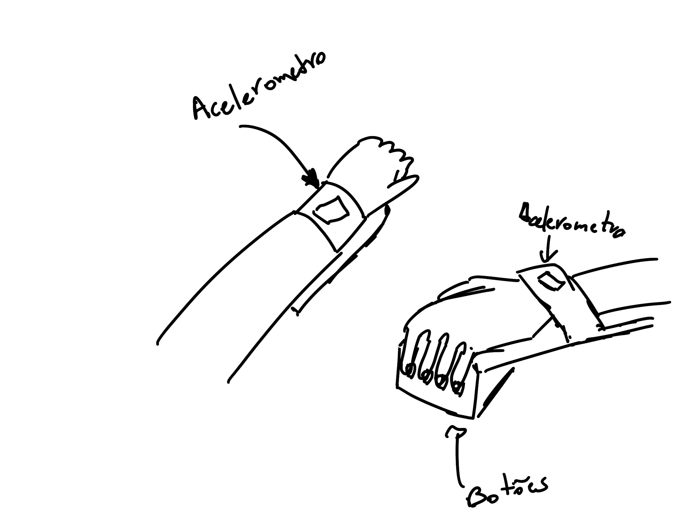

## Ideia do projeto
A proposta do nosso jogo é um controle para o Temple Run.

O jogador segura o controle e realiza movimentos físicos para controlar o personagem. A Raspberry Pi Pico 2 lê os dados da IMU MPU6050, executa um modelo de IA treinado no Edge Impulse e classifica o gesto realizado pelo jogador. A partir dessa classificação, o firmware envia comandos para o jogo no computador.

A proposta é usar a combinação de IA + RTOS. A IA será responsável por reconhecer os gestos do jogador, enquanto o RTOS será utilizado para organizar o firmware em tarefas independentes, como leitura da IMU, inferência do modelo, envio de comandos e feedback visual.

O personagem corre automaticamente e o jogador precisa reagir aos obstáculos usando quatro ações principais:

- mover para a esquerda;
- mover para a direita;
- pular;
- deslizar.

## Mapeamento dos comandos

| Gesto detectado pela IA | Ação no jogo |
|---|---|
| `idle` | Nenhuma ação |
| `left` | Mover para a faixa da esquerda |
| `right` | Mover para a faixa da direita |
| `jump` | Pular |
| `slide` | Deslizar |

Inicialmente, a ideia é treinar o modelo para reconhecer cinco classes:

- `idle`;
- `left`;
- `right`;
- `jump`;
- `slide`.

## Projeto mecânico do controle

O controle será construído em formato portátil, pensado para ser segurado com as duas mãos. A movimentação do controle será parte da jogabilidade, já que o jogador deverá inclinar ou movimentar o dispositivo para executar as ações do jogo.

A proposta mecânica inicial é:
- controle seria preso no braço (como se fosse um relógio)
- Raspberry Pi Pico 2 fixada dentro do controle;
- IMU MPU6050 posicionada de forma estável no interior do controle;
- LED RGB visível na parte externa para indicar o estado do sistema;
- botão físico para iniciar o controle;

## Inputs e outputs

### Inputs

| Componente | Função |
|---|---|
| IMU MPU6050 | Capturar aceleração e movimento do controle |
| Botão de calibração/start | Iniciar calibração ou começar o jogo |
| Botão opcional de pause | Pausar ou reiniciar o jogo |

### Outputs

| Componente | Função |
|---|---|
| LED RGB | Indicar estado do controle |
| Buzzer ou motor vibratório, opcional | Feedback para eventos do jogo |

## Estados indicados pelo LED RGB

| Estado | Indicação visual |
|---|---|
| Inicializando | LED piscando |
| Calibrando | LED amarelo |
| Controle pronto | LED verde |
| Gesto detectado | Cor muda rapidamente conforme o comando |
| Erro ou falha de leitura | LED vermelho |

